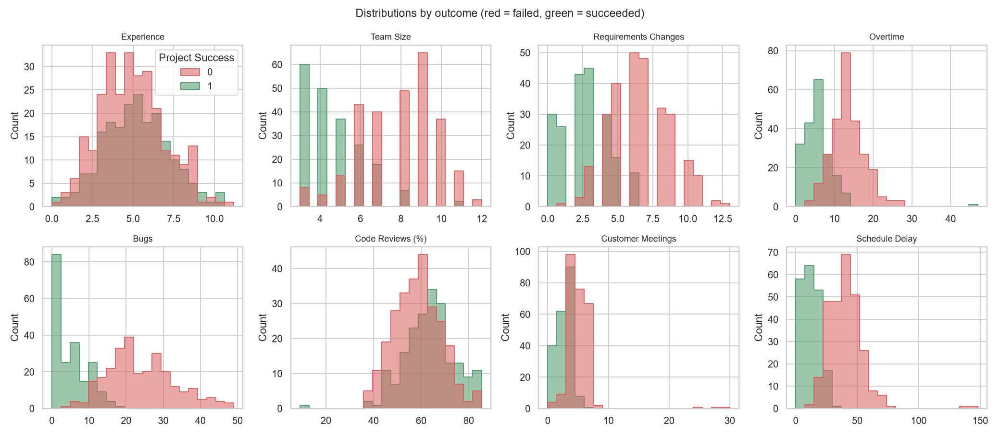
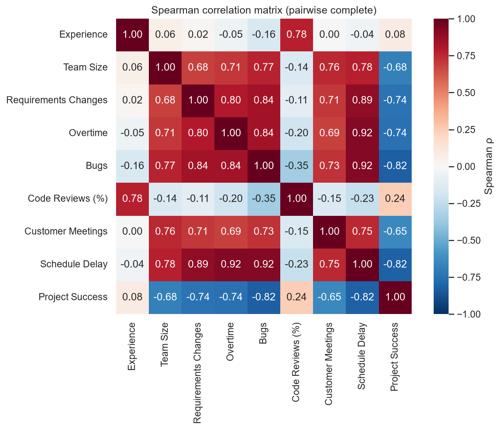
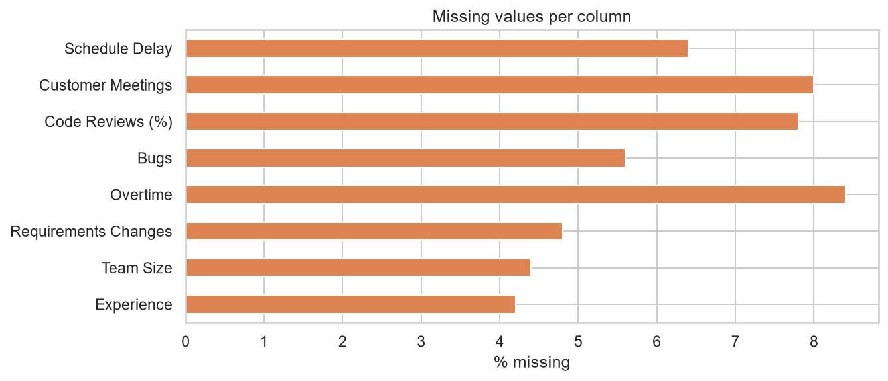
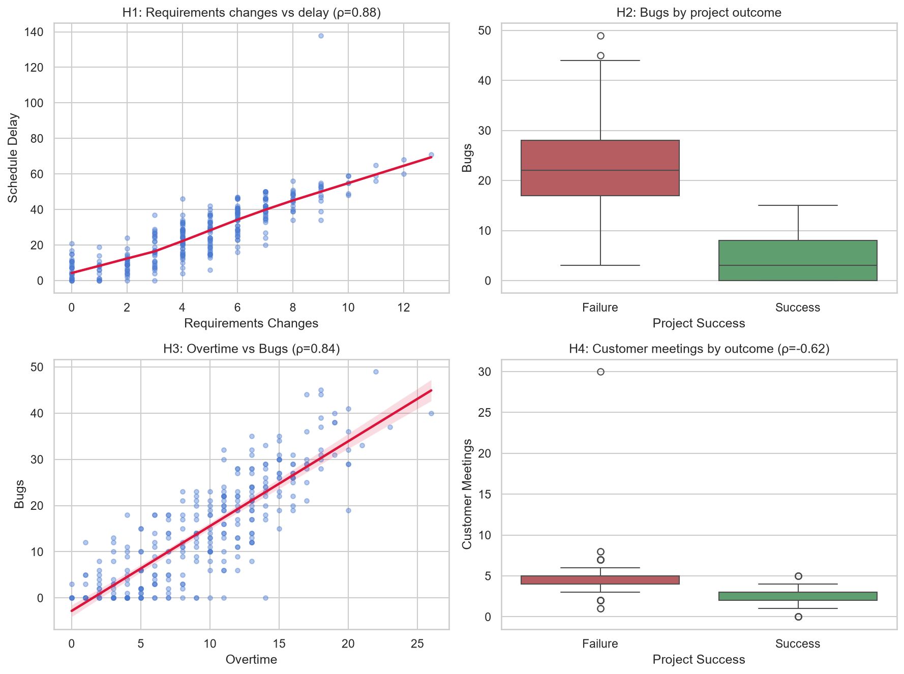
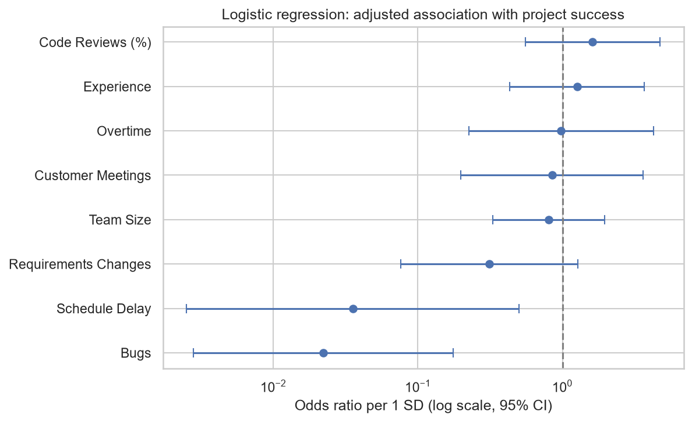
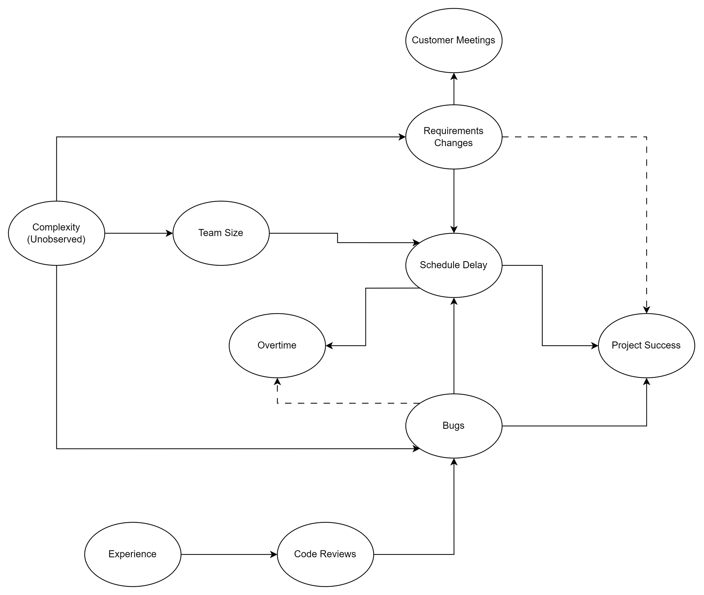

# Task 2 — Data Analysis & Causal Reasoning

Analysis of `project_dataset.csv`.

- 500 software projects
- 8 predictors
- binary outcome `Project Success`, base success rate 42%).

## How to run

```
pip install pandas numpy scipy statsmodels matplotlib seaborn
python analysis.py
```


## 1. Exploratory analysis




Notable findings:

- The dataset has 2 groups. One with Experience and Code Reviews and other with the rest.
- Bugs and Schedule Delay have the strongest (negative) association with Project Success.
- Because of variable grouping, we cannot clearly tell which variable directly influences Project Success.

### Missing values



Missing data is distributed relatively even over variables.
Only 292/500 rows are complete meaning discarding of affected rows would leave us with ~58% of the original data.

When compared to outcome, only Customer Meetings have big discrepancy in Success vs Fail.
That leads me to believe that missing data isn't MCAR.

Missing data was filled using median imputation.


### Outliers

I eye checked min-max values for each column and even though on distribution figure we can clearly see big outliers, all
values seemed plausible. No outlier was discarded.

---

## 2. Hypotheses


| #  | Hypothesis                                             | Explaination                                                      |
|----|--------------------------------------------------------|-------------------------------------------------------------------|
| H1 | More requirements changes -> Longer schedule delay     | Change of scope adds more work.                                   |
| H2 | More bugs -> Lower probability of success              | Bugs slow down project and add to teams burnout.                  |
| H3 | Delay -> More overtime                                 | Teams work overtime because they are late.                        |
| H4 | More customer meetings -> Lower probability of success | More customer meetings could mean that project is not going well. |


---

## 3. Test results



| #  | Result                                       | Verdict   |
|----|----------------------------------------------|-----------|
| H1 | ρ = +0.88, p ≈ 10e-94                        | Supported |
| H2 | Median 3 vs 22 bugs, Mann–Whitney p ≈ 10e-44 | Supported |
| H3 | ρ = +0.84, p ≈ 10e-77                        | Supported |
| H4 | ρ = −0.62, p ≈ 10e-33                        | Reversed  |

---

### Multivariate model



Once all variables enter one model, two variables emerge as especially impactful for project result:

- Bugs (β = −3.43, p < 0.001) and Schedule Delay (β = −3.43, p < 0.001) carry nearly all the signal.
- Requirements Changes retains a smaller effect (β = −1.08, p = 0.03).
- Team Size, Overtime, Customer Meetings, Code Reviews and Experience are no longer significant, meaning their standalone impact is through 3 variables mentioned above.

---

## 4. Causal reasoning on the main findings



Proposed structure (dashed arrows = ambiguous direction / feedback):

- **Project Complexity (unobserved)** - This can possibly be an unobserved variable that has positive correlation with Team Size, Bugs and Requirement Changes.
- **Overtime** - Overtime has a weird relation to Bugs. It's absolutely possible that Overtime creates Bugs and that Bugs create Overtime.
- **Overtime-Schedule Delay-Bugs** - This could possibly be a cycle if previous statement has merit.
- **Experience-Code Reviews-Bugs** - Experience and Code reviews reduce bugs and through that increase success of projects.

---

## 5. Additional variables I would collect

1. **Project complexity**: Complexity definitely impacts projects and I think it's behind the group of 6 variables. Measuring it would let us adjust for it directly.
2. **Team stability**: If a team had a lot of personnel changes during the project, I could see it being very impactful on its result.

---

## Assumptions

- `Overtime` is in hours/week/team, 
- `Schedule Delay` is in days, 
- `Experience` is in years
- `Customer Meetings` is total number of meetings